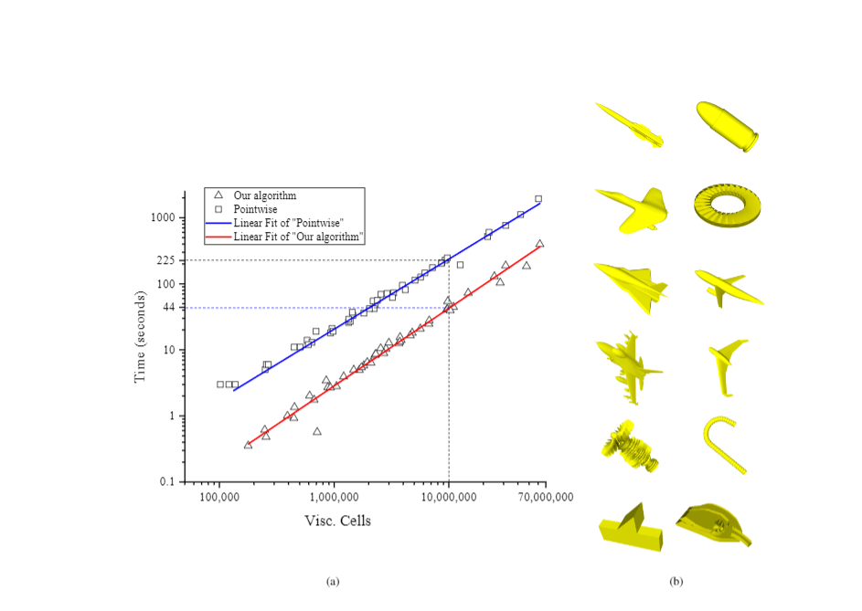

## Surface mesh module library for research

To show that this algorithm is stable and adaptable, a test model library containing 44 models was built. Publiccomplex 3D models were selected considering realistic industrial relevance, such as missile, aircraft-8, bullet, rocket.The scale of surface mesh in the library varies from thousands to millions, which can meet the applications of PCsimulation. All the model has been generated with boundary-layer mesh until prisms are isotropic, then isotropic Delaunay volume mesh generator is employed to fill the inner space[34]. Then we use Pointwise to generate hybridmesh with the same input by T-Rex. Timing data of the two above methods are record as show in Fig.18(a). Thehorizontal axis represents the number of viscous units, and the vertical axis represents the time consumed to generatethese viscous mesh (excluding IO). Logarithmic coordinates are used for both axes for clarity.

